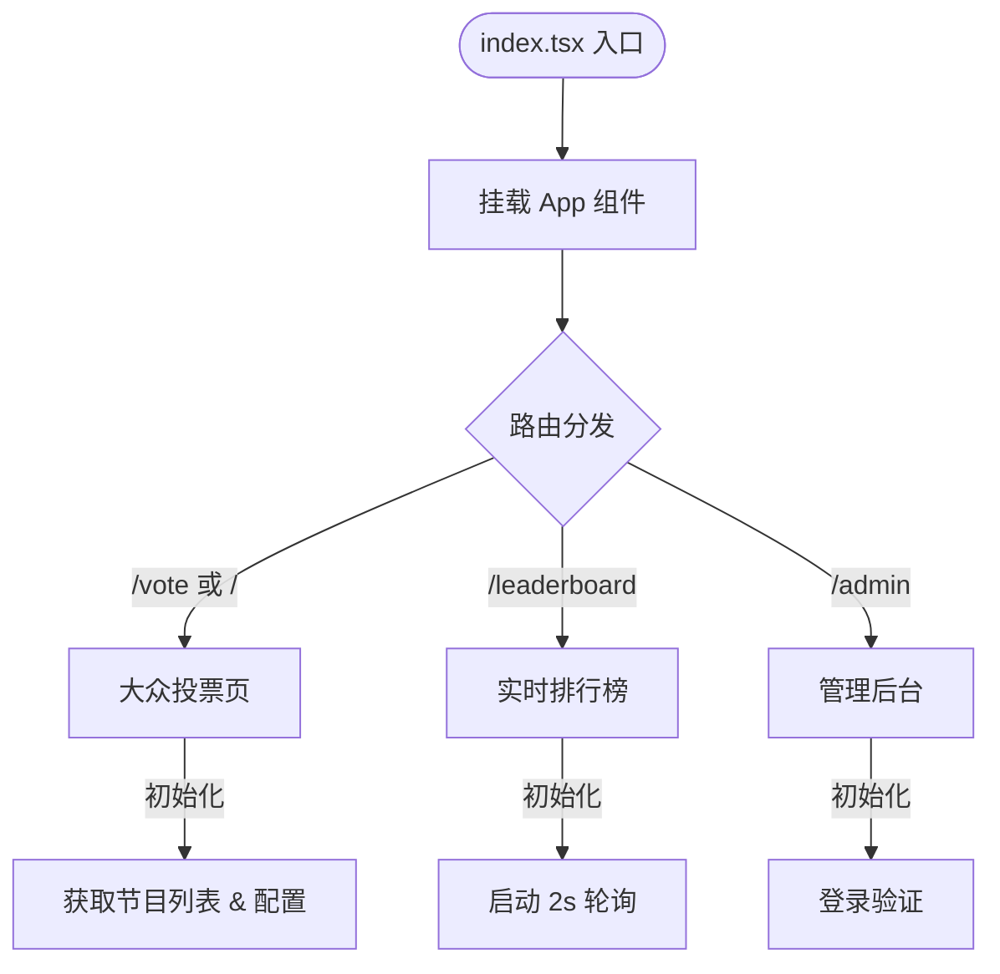
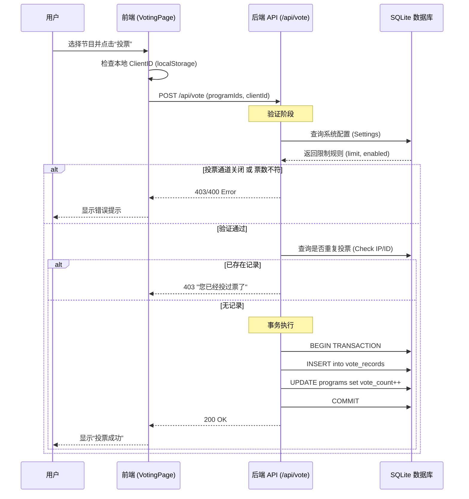
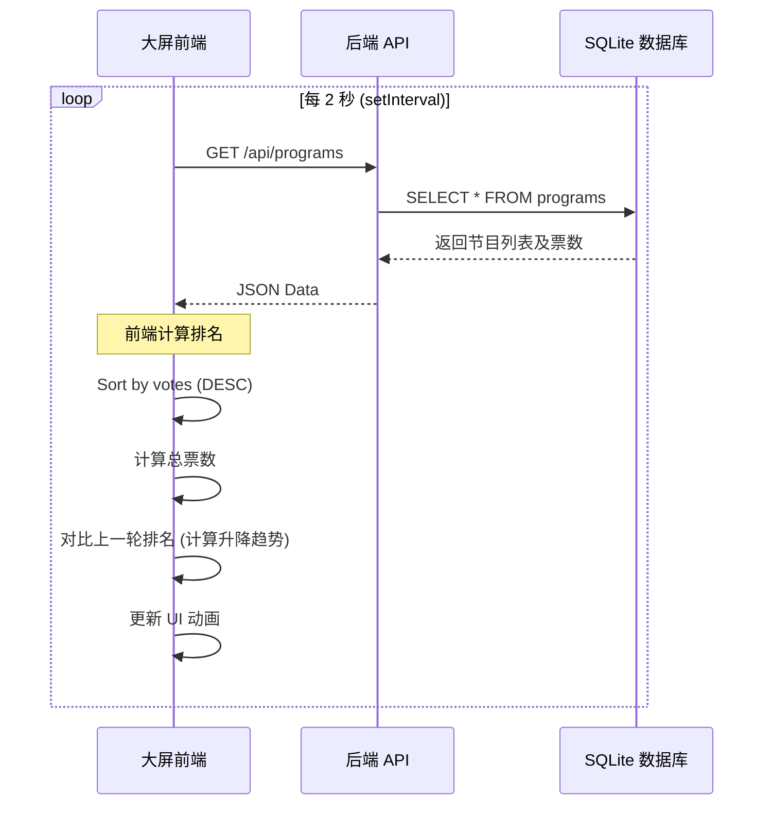

# 03. 核心逻辑流 (Core Logic Flow)

## 1. 程序启动与路由流程 (Startup & Routing)

前端应用从 `index.tsx` 启动，挂载 `App` 组件。`App.tsx` 内部集成了路由逻辑，根据 URL 分发到不同的业务页面。

## 2. 核心业务流程详解

### 2.1 投票流程 (Voting Process)

用户在投票页选择心仪的节目并提交。

### 2.2 排行榜实时刷新流程 (Leaderboard Polling)

大屏幕通过轮询机制保持数据实时性。

## 3. 关键分支与状态跳转

1.  **权限控制 (App.tsx / server.ts)**
    *   **投票开关**: `settings.voting_enabled` 控制全局投票功能。若为 `false`，API 直接拒绝投票请求。
    *   **管理员鉴权**: 后端硬编码验证密码。前端通过 `isAuthenticated` 状态控制显示登录页还是管理面板。

2.  **数据一致性 (server.ts)**
    *   **事务保障**: 投票操作（写入记录 + 更新票数）被包裹在 `db.serialize` 和 `BEGIN TRANSACTION` ... `COMMIT` 中，确保数据原子性。
    *   **防刷机制**: 双重验证——优先使用 `clientId` (LocalStorage)，兜底使用 `req.ip`。
