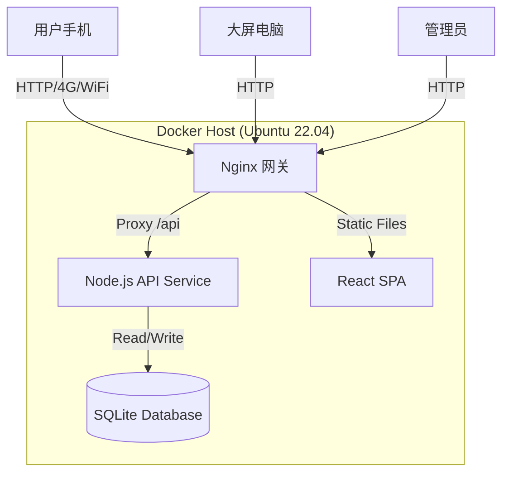

# 技术架构设计说明书

## 1. 系统架构概览

本系统采用经典的前后端分离架构 (Client-Server)，基于 Docker 容器化部署。



## 2. 技术栈详细选型

### 2.1 前端 (Frontend)
*   **框架**：React 18
*   **语言**：TypeScript
*   **构建工具**：Vite
*   **路由管理**：React Router v6
    *   `/` -> Redirect to `/vote` (默认)
    *   `/vote` -> 投票页
    *   `/screen` -> 大屏页
    *   `/admin` -> 管理页
*   **UI 组件库**：TailwindCSS (建议) 或手写 CSS，保持轻量。
*   **HTTP 客户端**：Axios 或 Fetch API。

### 2.2 后端 (Backend)
*   **运行时**：Node.js (v18/v20 LTS)
*   **Web 框架**：Express.js (轻量、灵活、上手快)
*   **语言**：TypeScript (保持与前端语言统一，类型安全)
*   **数据校验**：Zod (可选，用于 API 参数校验)

### 2.3 数据库 (Database)
*   **类型**：SQLite 3
*   **ORM/驱动**：`sqlite3` 原生驱动 或 `better-sqlite3` (性能更好)。
*   **持久化**：数据库文件 `database.sqlite` 挂载至 Docker Volume，防止容器重启丢失数据。

### 2.4 部署环境 (DevOps)
*   **容器化**：Docker
*   **编排**：Docker Compose
*   **反向代理**：Nginx (可选，或直接用 Node.js 托管静态文件，本次方案建议 Node.js 统一托管静态资源以简化部署，或者 Nginx 分离部署，视复杂度而定。**推荐方案：Node.js 提供 API，Nginx 提供静态资源服务并反向代理 API**)。

## 3. 目录结构规范

```text
/project-root
  ├── doc/                    # 文档目录
  ├── frontend/               # 前端工程
  │   ├── src/
  │   ├── package.json
  │   └── Dockerfile
  ├── backend/                # 后端工程
  │   ├── src/
  │   ├── data/               # SQLite 文件挂载点
  │   ├── package.json
  │   └── Dockerfile
  ├── docker-compose.yml      # 编排文件
  └── .gitignore
```

## 4. 关键技术点实现

### 4.1 防刷机制
*   **IP 限制**：后端中间件记录请求 IP。
*   **逻辑**：
    *   `Map<IP_Address, Timestamp>` 记录最近投票时间/次数。
    *   若同一 IP 在 N 秒内请求过多，或总数超过 1，则拒绝。
*   **设备指纹 (可选)**：前端生成 UUID 存入 localStorage，请求时带上。后端校验该 UUID 是否已投票。

### 4.2 实时刷新
*   **轮询 (Polling)**：前端使用 `setInterval` 每 2000ms 发送 `GET /api/programs`。
*   **优化**：后端增加缓存头 `Cache-Control: no-cache`，确保数据实时。

### 4.3 并发场景设计（大屏 + 300 人同时投票）

#### 4.3.1 目标场景
*   **大屏展示**：1 台大屏设备打开 `/leaderboard` 持续刷新榜单。
*   **移动端投票**：300 人同时打开 `/vote`，并在同一时间窗口内集中提交投票。
*   **约束**：保证高峰期系统不出现大面积 5xx；投票允许排队但不允许重复记票；大屏刷新不被投票高峰“拖死”。

#### 4.3.2 核心原则：读写分离 + 缓存吸收读压 + 写入排队不失败
*   **读路径（榜单/节目列表）**：将 `GET /api/programs` 视为高频读接口，用网关缓存吸收并发轮询，避免 300 人轮询直接打爆后端与 SQLite。
*   **写路径（投票提交）**：将 `POST /api/vote` 视为低频写接口（每用户一次），保证幂等/防重复，必要时允许短暂排队（busy/锁等待）但不出现大量失败。

#### 4.3.3 读路径设计：Nginx 微缓存（Micro-cache）
*   **缓存对象**：仅缓存 `GET /api/programs`（或进一步拆分为配置/榜单两类接口后分别缓存）。
*   **缓存 TTL**：0.5s～1s（足够“准实时”，但能把 300 人同一秒内的轮询合并为少量回源请求）。
*   **失败兜底**：开启 `stale-if-error` 思路（上游失败时短暂返回旧缓存），将“5xx”转化为“略旧数据”。
*   **一致性预期**：榜单允许 1 秒内的最终一致；投票提交返回成功后，榜单在下一次刷新（≤1s）可见即可。

#### 4.3.4 前端刷新策略（避免不必要的轮询风暴）
*   **默认轮询**：移动端与大屏默认 2s（或 1s）一次，不建议长期 0.5s。
*   **高峰窗口策略**：仅在倒计时最后 N 秒（例如 10 秒）提高刷新频率（例如 1s），结束后恢复为 2s～3s。
*   **退避策略**：若连续出现接口失败（网络抖动或上游保护），采用指数退避（2s→4s→8s）直至恢复。

#### 4.3.5 投票接口设计：幂等、防重复与限流
*   **客户端标识**：投票请求携带 `clientId`（前端生成并持久化），后端以其为“用户唯一标识”（优先于 IP，避免 NAT 误伤）。
*   **防重复的强约束**：通过数据库唯一约束/原子写入确保“同一 clientId 只能成功一次”，避免并发双击、网络重试造成重复记票。
*   **网关限流**：对 `POST /api/vote` 做 IP 级别的速率限制与突发放行，阻断异常脚本；限流返回 429，并提示稍后重试。

#### 4.3.6 可选增强：SSE 推送替代轮询（优先用于大屏）
*   **大屏**：使用 SSE（Server-Sent Events）由后端主动推送榜单（1s 一次），大屏保持 1 条长连接。
*   **收益**：将“多次短连接轮询”变为“单连接推送”，更平滑、更省资源。
*   **注意**：SSE 仍建议配合缓存与断线重连策略。

### 4.3 安全鉴权
*   **Admin 路由**：
    *   前端：`/admin` 页面加载时检查 `sessionStorage` 是否有 Token。无则显示登录框。
    *   后端：所有 `/api/admin/*` 接口需校验 Request Header 中的 `Authorization` 字段。
    *   **Token 生成**：简单的 JWT 或随机字符串映射（考虑到复杂度，简易系统可用固定 Token 或简单 Session）。
