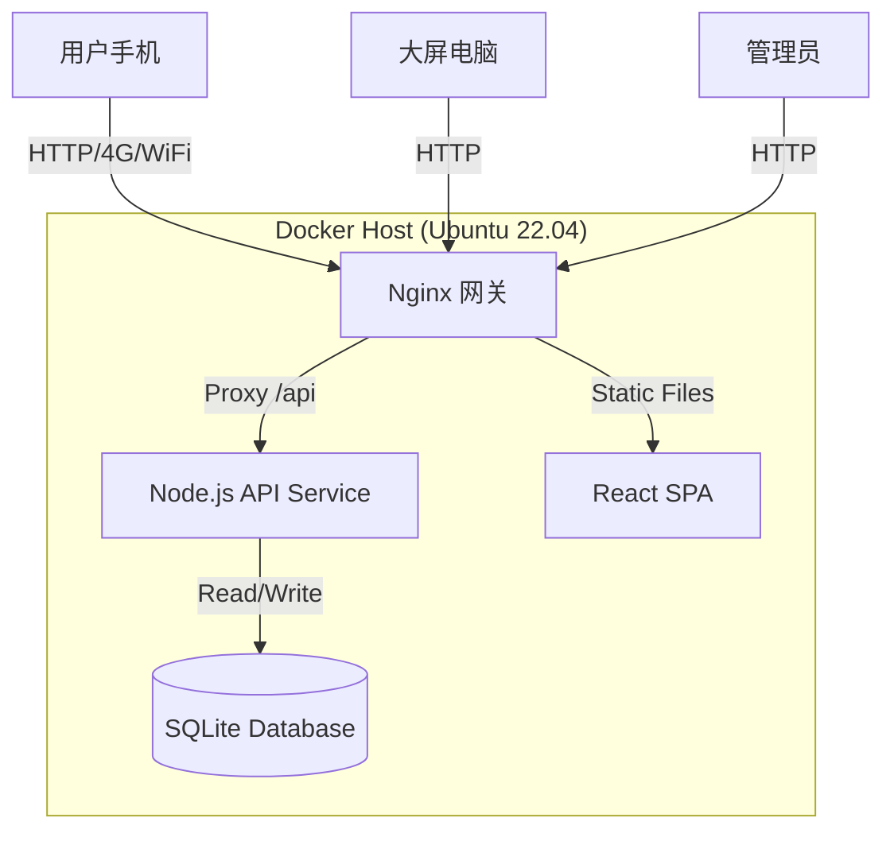

# 技术架构设计说明书

## 1. 系统架构概览

本系统采用经典的前后端分离架构 (Client-Server)，基于 Docker 容器化部署。



## 2. 技术栈详细选型

### 2.1 前端 (Frontend)
*   **框架**：React 18
*   **语言**：TypeScript
*   **构建工具**：Vite
*   **路由管理**：React Router v6
    *   `/` -> Redirect to `/vote` (默认)
    *   `/vote` -> 投票页
    *   `/screen` -> 大屏页
    *   `/admin` -> 管理页
*   **UI 组件库**：TailwindCSS (建议) 或手写 CSS，保持轻量。
*   **HTTP 客户端**：Axios 或 Fetch API。

### 2.2 后端 (Backend)
*   **运行时**：Node.js (v18/v20 LTS)
*   **Web 框架**：Express.js (轻量、灵活、上手快)
*   **语言**：TypeScript (保持与前端语言统一，类型安全)
*   **数据校验**：Zod (可选，用于 API 参数校验)

### 2.3 数据库 (Database)
*   **类型**：SQLite 3
*   **ORM/驱动**：`sqlite3` 原生驱动 或 `better-sqlite3` (性能更好)。
*   **持久化**：数据库文件 `database.sqlite` 挂载至 Docker Volume，防止容器重启丢失数据。

### 2.4 部署环境 (DevOps)
*   **容器化**：Docker
*   **编排**：Docker Compose
*   **反向代理**：Nginx (可选，或直接用 Node.js 托管静态文件，本次方案建议 Node.js 统一托管静态资源以简化部署，或者 Nginx 分离部署，视复杂度而定。**推荐方案：Node.js 提供 API，Nginx 提供静态资源服务并反向代理 API**)。

## 3. 目录结构规范

```text
/project-root
  ├── doc/                    # 文档目录
  ├── frontend/               # 前端工程
  │   ├── src/
  │   ├── package.json
  │   └── Dockerfile
  ├── backend/                # 后端工程
  │   ├── src/
  │   ├── data/               # SQLite 文件挂载点
  │   ├── package.json
  │   └── Dockerfile
  ├── docker-compose.yml      # 编排文件
  └── .gitignore
```

## 4. 关键技术点实现

### 4.1 防刷机制
*   **IP 限制**：后端中间件记录请求 IP。
*   **逻辑**：
    *   `Map<IP_Address, Timestamp>` 记录最近投票时间/次数。
    *   若同一 IP 在 N 秒内请求过多，或总数超过 1，则拒绝。
*   **设备指纹 (可选)**：前端生成 UUID 存入 localStorage，请求时带上。后端校验该 UUID 是否已投票。

### 4.2 实时刷新
*   **轮询 (Polling)**：前端使用 `setInterval` 每 2000ms 发送 `GET /api/programs`。
*   **优化**：后端增加缓存头 `Cache-Control: no-cache`，确保数据实时。

### 4.3 安全鉴权
*   **Admin 路由**：
    *   前端：`/admin` 页面加载时检查 `sessionStorage` 是否有 Token。无则显示登录框。
    *   后端：所有 `/api/admin/*` 接口需校验 Request Header 中的 `Authorization` 字段。
    *   **Token 生成**：简单的 JWT 或随机字符串映射（考虑到复杂度，简易系统可用固定 Token 或简单 Session）。
